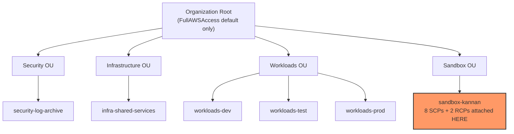
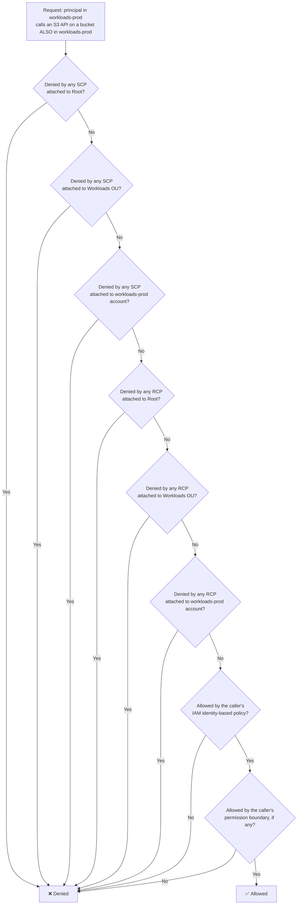
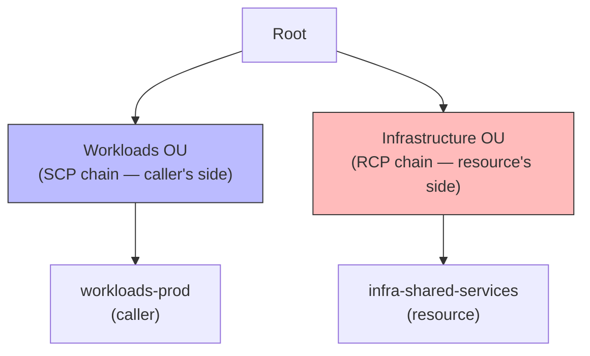

# Policy Inheritance Across the OU Hierarchy

## The concept

SCPs and RCPs can be attached at three levels: the organization **root**, any **OU**, or an individual **account**. A policy attached higher up doesn't replace policies attached lower down — it stacks with them. Every account's *effective* set of guardrails is determined by walking up the tree from the account to the root and combining every policy found along the way.

The mental model that matters most (and the one this whole repo has been using): **SCPs/RCPs never grant anything — every account/OU/root always has AWS's own built-in `FullAWSAccess` (or `RCPFullAWSAccess`) policy attached by default, which allows everything.** Every custom policy you write is `Deny`-only, subtracting from that baseline. So the practical evaluation question at any level is simply:

> "Is this action denied by *any* SCP/RCP attached to this account, or to any OU above it, or to the root?"

If the answer is yes at **any** level in the chain, the action is blocked — full stop. A permissive policy lower down can never override a `Deny` higher up. This is why attaching a policy to an OU is more powerful than attaching it to a single account: it automatically applies to every account under that OU, present and future, with zero extra work.

(There's a more complex version of this when a policy uses `Allow` to build an explicit allow-list instead of the default deny-list style — in that case an action must be allowed by *at least one* policy at *every* level, not just unblocked by all of them. None of the 8 SCPs or 2 RCPs in this repo use `Allow`, so the simpler "deny stacks, allow doesn't need re-stating" model is the one that applies here.)

## Our actual repo, visualized

Right now, every SCP and RCP in this repo is attached directly to a single account — `sandbox-kannan` — not to any OU or the root. Nothing is inherited by `workloads-dev`, `workloads-test`, `workloads-prod`, or any other account, because nothing is attached above the account level.

If we instead attached those same policies to the **Sandbox OU** rather than the account, they'd apply to every current and future account under Sandbox automatically — that's the inheritance benefit. If we attached them to the **root**, every account in the entire organization (Security, Infrastructure, Workloads, Sandbox — all of them) would inherit them at once, which is exactly why the repo's whole testing strategy has been "attach to one low-stakes account first, only widen scope once verified" — a mistake attached at the root affects everything, everywhere, immediately.

## How a single request is actually evaluated

The point easy to miss (and worth catching yourself on before an interviewer does): **RCP walks up its own three-level chain exactly the same way SCP does — root → OU → account.** It's not evaluated as a single vague "resource-side check," it's three separate gates, structurally identical to the SCP chain. The only question is *whose* account each chain starts from.

**Case 1 — same-account call.** A principal in `workloads-prod` calls an S3 API on a bucket that's *also* in `workloads-prod`. Here, the SCP chain (walking up from the caller) and the RCP chain (walking up from the resource) happen to be the exact same three nodes — Root, Workloads OU, `workloads-prod` — just evaluated for two different policy types at each stop:

**Case 2 — cross-account call, same org.** Now the same principal in `workloads-prod` calls an S3 API on a bucket that lives in `infra-shared-services` (under the Infrastructure OU) instead. The two chains **diverge** — they only share the root:

SCPs attached to the Workloads OU or `workloads-prod` never come into play for this request at all — the RCP side only ever cares about the resource's own ancestry (Root → Infrastructure OU → `infra-shared-services`), regardless of where the caller sits. This is exactly why SCP #8 (identity perimeter) and RCP #1 (resource perimeter) in this repo are genuinely complementary rather than redundant: they walk different trees, and an org-wide guarantee needs both, not just one attached everywhere.

## Likely interview questions

**Q: An OU has an SCP that denies `s3:DeleteBucket`. An account under that OU has no SCP directly attached. Can a role in that account still delete an S3 bucket?**
A: No. The account inherits every Deny from every OU above it, all the way to the root, regardless of what's attached directly to the account itself.

**Q: If you want a new guardrail to apply to every account in the org immediately, where do you attach it?**
A: The root. But that's also the highest-blast-radius place to make a mistake — best practice is to prove the policy on a single low-stakes account first, then an OU, then the root, exactly the "phased rollout" pattern covered in the blast-radius doc.

**Q: Does moving an account between OUs change which SCPs apply to it?**
A: Yes, immediately — the account stops inheriting the old OU's policies and starts inheriting the new OU's policies (still combined with whatever's at the root). This is also why "which OU is this account in" is itself a security-relevant fact, not just an organizational label.

**Q: For a cross-account S3 call within the same org, does the caller's OU's SCPs and the bucket owner's OU's RCPs both get evaluated?**
A: Yes, but they're two independent chains, not one merged one. SCPs are evaluated by walking up from the *caller's* account to the root; RCPs are evaluated by walking up from the *resource's* account to the root. If the caller and resource are in different OUs, those two chains only share the root — an SCP attached to the caller's OU and an RCP attached to the resource's OU both apply to the same request, but neither chain sees the other's OU-level policies at all.
