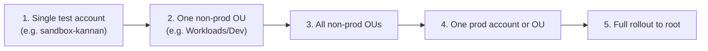

# Blast Radius Analysis & Phased Rollout

## The concept

"Blast radius" is just a name for a question this repo has been asking informally the entire time: **if this policy change turns out to be wrong, how much breaks, and how visibly?** A typo in an SCP attached to one sandbox account might silently annoy one person for five minutes. The same typo attached to the organization root could lock every team in the company out of a service simultaneously. Same mistake, wildly different blast radius, purely because of *where* it was attached.

Formal blast radius analysis is the practice of deliberately estimating that impact *before* attaching a policy, rather than discovering it from an incident.

## The three-part method

**1. Historical impact analysis (before rollout)**
Query CloudTrail (directly, or via CloudTrail Lake / Athena for larger lookback windows) for the exact actions the new policy would deny, scoped to the accounts it would affect, over a meaningful window (30–90 days is typical). If a legitimate workload is already calling `s3:PutBucketAcl` weekly and your new SCP would deny it, you find that out from history, not from a page at 2am. This is the single most valuable step and the one most teams skip under time pressure.

**2. Staged, low-blast-radius testing**
Exactly what this repo did for every one of its 10 policies: attach to one throwaway account first (`sandbox-kannan`), verify the expected allow/deny behavior with real test calls, *then* widen scope. Never attach an untested policy directly to an OU or the root.

**3. Phased rollout with bake time**
Move outward in deliberate waves, typically:

Each wave gets a bake period (hours to days, depending on how business-critical the affected accounts are) with active CloudTrail monitoring for new `AccessDenied` events citing the policy, before moving to the next wave. If something breaks, you roll back the last wave, not the whole rollout.

## Rollback

Because SCPs/RCPs are just Terraform resources here, rollback is git-native: revert the commit that attached (or widened) the policy, `terraform apply`, and the attachment is removed. The important operational point is having this ready *before* the rollout starts, not improvising it during an incident — know in advance whether "rollback" means detaching the whole policy or narrowing its target back to the previous wave.

## Tie-in to this repo

Every single lesson in this repo followed step 2 of this method without naming it: SCP #1 through #8, both RCPs, and the permission boundary were all attached to `sandbox-kannan` only, tested with real CLI calls, and never widened past that one account. That's a real, honestly-described example of "phased rollout, stopped at wave 1" you can talk about directly in an interview — you don't have to invent a hypothetical.

## Likely interview questions

**Q: How do you assess the blast radius of a new SCP before attaching it to the organization root?**
A: Query CloudTrail history for the specific actions it would deny, across every account it would eventually affect, to find any legitimate current usage. Then attach it first to a single low-stakes account, verify behavior with real test calls, and only widen scope in stages — non-prod before prod, one OU before the root — with a bake period and active monitoring between each stage.

**Q: What's your rollback plan if a newly-attached SCP breaks a production workload?**
A: If it's Terraform-managed, revert the commit that attached/widened it and re-apply — that's a clean, auditable rollback. The prerequisite is knowing this plan *before* the rollout, including exactly which wave to roll back to, not deciding it live during the incident.

**Q: Why is CloudTrail history analysis more valuable than just testing in a sandbox account?**
A: A sandbox account only tells you what a *test* workload does. Historical CloudTrail data tells you what your *real, currently-running* workloads actually do — which is the thing you're actually at risk of breaking. The two checks catch different classes of mistakes; neither replaces the other.
