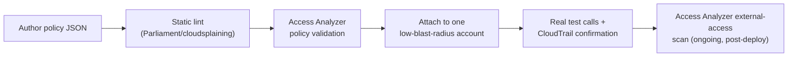

# Policy Testing & Validation Tooling

## The honest starting point: there's no native "dry run" for SCPs/RCPs

Unlike, say, an EC2 API call (which often supports `--dry-run`), there is no AWS API to ask "if I attached this SCP here, what would it break?" ahead of time. This repo's entire testing strategy — attach to one sandbox account, make real API calls, read the actual `AccessDenied` error — exists precisely *because* that gap exists. That's a defensible, correct answer in an interview: the real tooling landscape is genuinely limited here, and knowing that (rather than assuming some simulator handles it end-to-end) is itself the useful knowledge.

## What each real tool actually does (and doesn't)

**IAM Policy Simulator**
Tests whether a specific principal/action/resource combination would be allowed, based on identity-based policies, resource-based policies, and permission boundaries. The commonly-missed limitation: **it does not evaluate SCPs or RCPs.** A simulation can say "yes, this role's IAM policy allows this" while an SCP somewhere above it would still block the real call. Useful for identity-policy and permission-boundary debugging (exactly the kind of thing lesson 6 covered), not for SCP/RCP validation.

**IAM Access Analyzer — policy validation**
When you author or edit a policy (identity-based, resource-based, or an SCP/RCP), Access Analyzer can run around 100 automated checks against it — catching things like unreachable statements, overly permissive wildcards, or syntax problems — *before* you deploy it. This is a real, useful pre-deployment gate, and it's the kind of check a CI pipeline should run automatically (see the CI/CD doc).

**IAM Access Analyzer — external/unused access analysis**
A different feature of the same service: continuously scans resource-based policies (S3 bucket policies, KMS key policies, IAM role trust policies, etc.) and flags anything granting access to a principal *outside* your account or organization. Directly relevant to the resource-perimeter work from RCP #1 and the "critical assets" (logging buckets, KMS keys) work in job 2 — it's how you'd continuously verify those resource policies haven't drifted into over-permissiveness.

**CloudTrail-based empirical testing**
What this repo actually did throughout: make the real API call as the real (or assumed) principal, and read the resulting error. When a request is denied by an SCP, the error explicitly names the policy ID (`...with an explicit deny in a service control policy: arn:aws:organizations::...`) — which is strictly more informative than a simulator's yes/no, because it tells you exactly which policy to go fix. CloudTrail also retains this history, so the same event can be queried after the fact for the blast-radius analysis described in that doc.

**Open-source IAM linters (Parliament, cloudsplaining, etc.)**
Tools that statically analyze policy JSON for known-bad patterns (privilege escalation vectors, overly broad wildcards) without needing to actually deploy anything. These are the kind of check that plugs into a CI pipeline as a fast, pre-merge gate, complementing (not replacing) Access Analyzer's validation.

## Putting it together: a realistic validation flow

Notice the IAM Policy Simulator doesn't appear in this flow at all for SCP/RCP work — it belongs in the permission-boundary/identity-policy world instead.

## Likely interview questions

**Q: Can you use the IAM Policy Simulator to test whether an SCP will block an action?**
A: No — the Simulator evaluates identity-based policies, resource-based policies, and permission boundaries, but it does not incorporate SCPs or RCPs into its result. The only reliable way to confirm SCP/RCP behavior is a real test call against an account the policy is actually attached to, or reading CloudTrail history.

**Q: How would you catch an overly-permissive policy before it's ever deployed?**
A: Two layers — a static linter (Parliament/cloudsplaining) as a fast pre-merge CI check, and IAM Access Analyzer's policy validation (the ~100 automated checks) as a more authoritative pre-deployment gate. Neither requires the policy to actually be attached anywhere yet.

**Q: How do you continuously verify a critical resource (like a KMS key or logging bucket) hasn't drifted into being externally accessible?**
A: IAM Access Analyzer's external-access analysis runs continuously against resource-based policies and flags any grant to a principal outside your account/org — that's the ongoing detection layer, distinct from the one-time validation done at authoring time.
