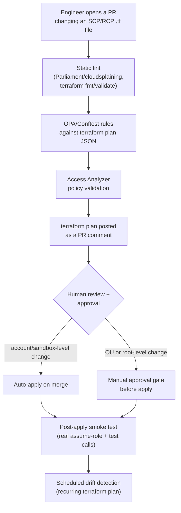

# CI/CD for Policy Deployment

## What changes versus how this repo was actually used

Every apply in this repo was run manually, from a terminal, by one person, after a conversational back-and-forth review. That's exactly right for learning — you want to see every plan and every error yourself. Job 1 explicitly asks for "policy testing and validation pipelines to prevent organization-wide impact," which means: the same Terraform code, but the human running `terraform apply` locally is replaced by a pipeline that enforces the checks automatically, every time, for every change, regardless of who wrote it.

## A realistic pipeline, stage by stage

The key design decision, directly tied to the blast-radius doc: **the approval gate should scale with blast radius, not be uniform.** A policy change scoped to a single sandbox account can reasonably auto-apply on merge — that's the same low-stakes tier this repo tested everything at. A change that attaches or widens a policy at an OU or the root should require an explicit manual approval step, separate from the code-review approval, precisely because that's the "wave 4/5" territory from the phased-rollout model.

## Stages worth naming individually in an interview

- **Static lint** — fast, cheap, catches obvious mistakes (malformed JSON, forbidden patterns) before anything talks to AWS. This is the stage that would have caught the RCP `Action: "*"` mistake from lesson 5 immediately, instead of at `terraform apply`.
- **`terraform plan` as a PR artifact** — reviewers should see the actual diff of what will change in AWS, not just the HCL diff, before approving.
- **Access Analyzer validation** — an AWS-native check, catching security-relevant policy issues Terraform itself doesn't know to look for.
- **Post-apply smoke test** — after the pipeline applies, automatically assume a known test role and make a couple of real calls that should succeed and a couple that should now be denied, exactly like the manual CLI tests done throughout this repo, just automated and run on every deploy instead of once by hand.
- **Drift detection** — a recurring (e.g. nightly) `terraform plan` against the same state, to catch anything changed outside the pipeline (a console click, a break-glass detach that was never re-applied) before it silently diverges from what's in git.

## State and locking (already covered, worth connecting here)

This repo's S3 backend with native locking (`use_lockfile`) isn't just a nice-to-have for a solo learner — it's a hard requirement the moment more than one person or one pipeline run can touch the same Terraform state concurrently. A CI pipeline applying policy changes needs exactly this: a shared, locked, remote state backend, so two simultaneous pipeline runs (or a pipeline run racing a manual `apply`) can't corrupt state.

## Likely interview questions

**Q: Should every policy change go through the same approval process regardless of scope?**
A: No — the approval gate should scale with blast radius. A change scoped to one sandbox account can reasonably auto-apply after passing automated checks; a change attaching or widening a policy at an OU or the organization root should require an additional, explicit manual approval step beyond normal code review.

**Q: What would a pipeline have caught that this repo's manual workflow didn't, until `terraform apply` actually failed?**
A: The RCP `Action: "*"` syntax mistake from lesson 5 — a static lint rule checking for unscoped `Action` values in RCP documents would have failed the PR immediately, instead of the mistake only surfacing as an AWS API error during `terraform apply`.

**Q: How do you prevent two people (or a pipeline and a person) from corrupting Terraform state for shared policy code?**
A: A remote backend with locking — in this repo's case, S3 with `use_lockfile` — so a concurrent `apply` is blocked/queued rather than racing against another in-flight change.
